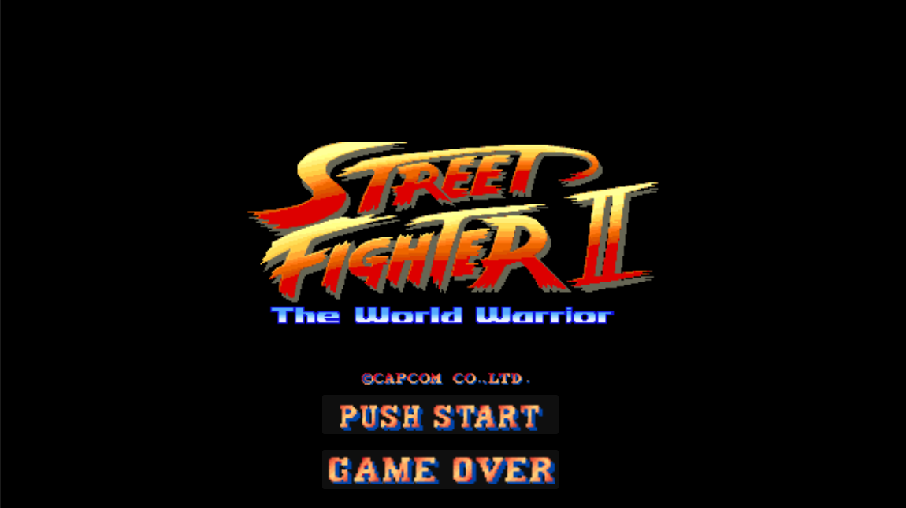

# Street Fighter



Videojuego de lucha 2D para dos jugadores desarrollado en Godot 4. Dos jugadores eligen su personaje y se enfrentan en una arena con sistema de combate completo.

## Características

- 2 jugadores local (mismo teclado)
- 3 personajes seleccionables
- 6 tipos de ataque (golpe y patada: débil, medio, fuerte)
- Sistema de daño con hitbox y hurtbox
- HUD con barras de vida, nombres y temporizador
- Música de fondo en menú y combate
- Fin de ronda por KO o tiempo

## Controles

### Jugador 1 (Teclado)

| Acción | Tecla |
|--------|-------|
| Moverse izquierda | A |
| Moverse derecha | D |
| Saltar | W |
| Agacharse | S |
| Golpe fuerte | O |
| Golpe medio | I |
| Golpe débil | U |
| Patada fuerte | L |
| Patada media | K |
| Patada débil | J |

### Jugador 2 (Teclado)

| Acción | Tecla |
|--------|-------|
| Moverse izquierda | ← |
| Moverse derecha | → |
| Saltar | ↑ |
| Agacharse | ↓ |
| Golpe fuerte | 6 (teclado numérico) |
| Golpe medio | 5 (teclado numérico) |
| Golpe débil | 4 (teclado numérico) |
| Patada fuerte | 3 (teclado numérico) |
| Patada media | 2 (teclado numérico) |
| Patada débil | 1 (teclado numérico) |

## Personajes

- DeeJay
- Cammy
- M.Bison

## Cómo ejecutar

1. Abrir el proyecto en Godot 4.6
2. Presionar F5
3. En el menú principal, presionar "Iniciar"
4. P1 elige un personaje, luego P2 elige el suyo
5. ¡A combatir!

## Estructura del proyecto

```
dev/
  assets/
    audio/              -- Archivos de música (menu.mp3, select.mp3, fight_intro.mp3, fight_bg.mp3)
    characters/         -- Sprites y spritesheets de cada personaje
    icons/              -- Recursos AtlasTexture para botones
    stage/              -- Fondos de escenario y tipografía ARCADE_I.TTF
  scenes/
    main_menu.tscn      -- Menú principal
    EleccionPersonaje.tscn -- Pantalla de selección de personajes
    arena.tscn          -- Escena de combate
    Fighter.tscn        -- Escena base del personaje
    player.tscn         -- Escena de prueba
    personajes/         -- Escenas específicas de cada personaje
      bison.tscn
      Cammy.tscn
      dee_jay.tscn
  scripts/
    game_manager.gd     -- Estado global del juego (autoload)
    arena.gd            -- Control de ronda y HUD
    eleccion.gd         -- Lógica de selección de personajes
    main_menu.gd        -- Navegación del menú principal
    player.gd           -- Script de prueba
    characters/
      fighter.gd        -- Clase Fighter con sistema de combate
    hitbox.gd           -- Area2D para aplicar daño
    hurtbox.gd          -- Area2D para recibir daño
```

## Sistema de combate

El personaje funciona con una máquina de estados:

- **IDLE** — estado de reposo, espera input
- **LEFT / RIGHT** — desplazamiento horizontal
- **JUMP** — salto con movimiento horizontal
- **CROUCH** — posición agachado
- **PUNCH / KICK** — ataques con 3 potencias cada uno (DEBIL, MEDIO, FUERTE)
- **HURT** — recuperación tras recibir daño
- **KO** — derrota cuando la vida llega a 0
- **WIN** — victoria (reservado)

Cada ataque tiene daño, knockback, tiempo activo y tiempo de recuperación propios.

El facing se ajusta automáticamente hacia el oponente.

La ronda termina cuando un jugador llega a 0 de vida (KO) o cuando el temporizador de 60 segundos llega a 0.

## Arquitectura

- **GameManager** (autoload): singleton central que almacena los personajes seleccionados, controla la música de fondo y maneja transiciones entre escenas
- **Arena**: controla la ronda, instancia los personajes dinámicamente según la selección, actualiza el HUD (barras de vida, nombres, temporizador) y maneja el fin del combate
- **Fighter**: clase base con máquina de estados, sistema de inputs, física, facing automático y gestión de daño
- **Hitbox** (Area2D): detecta colisiones con hurtboxes enemigos y aplica daño y knockback
- **Hurtbox** (Area2D): recibe golpes y redirige el daño al Fighter propietario

## Créditos

- Lógica y código: Desarrollador
- Animaciones de personajes: Amigo
- Motor: Godot 4.6
